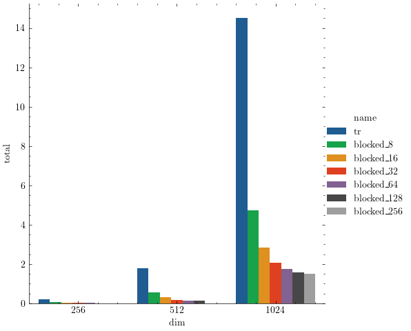
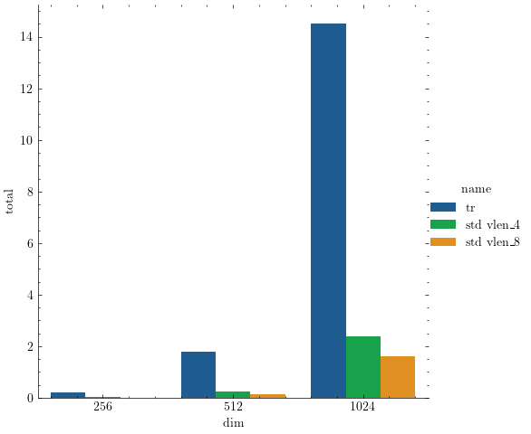
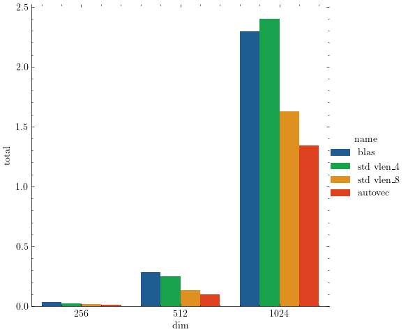

Optimize single-threaded General Matrix Multiplication (GEMM) fo two square matrices

## Transpose the second matrix


## Blocking


## Tiling


## Vectorization with std::experimental::simd


## Automatic vectorization on Clang


## OpenBLAS


## Build

```
mkdir build
cd build
cmake .. -DCMAKE_CXX_COMPILER=clang++
cmake --build . --
```

## Run the benchmarks
```
export $OMP_NUM_THREADS=1
./bench-gemm [dim_size]
```
